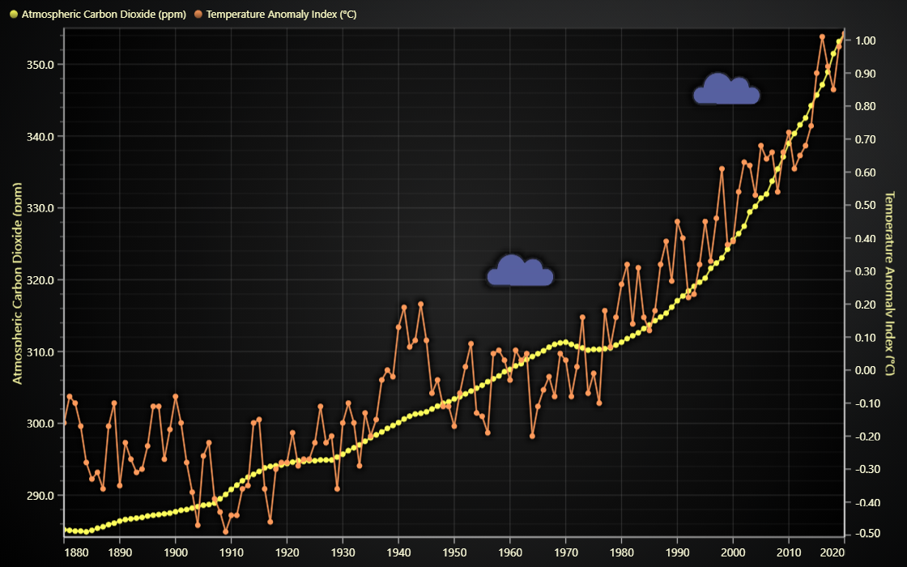

# JavaScript Temperature Anomaly Chart



This demo application belongs to the set of examples for LightningChart JS, data visualization library for JavaScript.

LightningChart JS is entirely GPU accelerated and performance optimized charting library for presenting massive amounts of data. It offers an easy way of creating sophisticated and interactive charts and adding them to your website or web application.

The demo can be used as an example or a seed project. Local execution requires the following steps:

-   Make sure that relevant version of [Node.js](https://nodejs.org/en/download/) is installed
-   Open the project folder in a terminal:

          npm install              # fetches dependencies
          npm start                # builds an application and starts the development server

-   The application is available at _http://localhost:8080_ in your browser, webpack-dev-server provides hot reload functionality.


## Description

This example shows visualization of **Temperature anomaly index** and **Atmospheric Carbon Dioxide** in parts per million (ppm for short) for period from 1880 to 2020.

-   **Temperature anomaly** means a departure from a reference value or long-term average. A positive anomaly indicates that the observed temperature was warmer than the reference value, while a negative anomaly indicates that the observed temperature was cooler than the reference value.

This chart has two Y axes since it displays two trends on the same time range, but with different value ranges.

The extra Y axis on the right side is created like this

```ts
const axisY2 = chart.addAxisY({ opposite: true })
```

When creating series, the connected axes can be explicitly defined like so

```ts
const temperatureAnomalyIndexSeries = chart.addLineSeries({ yAxis: axisY2 })
```

Additionally, this example showcases adding animated video icons inside the chart. The thunderclouds in this example are displayed from an attached `.mp4` asset file, which is displayed using an `UIElement`.

```ts
const video = document.createElement('video')
video.src = 'thundercloud.mp4'

const uiIcon = chart.addUIElement().setBackground((background) => background.setFillStyle(new ImageFill({ source: video })))
```

[Storm](https://icons8.com/icon/9t5k4YMYvtFl/storm) icon by [Icons8](https://icons8.com)


## API Links

* [Chart XY]
* [Axis]
* [Numeric tick strategy]
* [Datetime tick strategy]
* [Line series]
* [Image fill style]
* [UI text box]


## Support

If you notice an error in the example code, please open an issue on [GitHub][0] repository of the entire example.

Official [API documentation][1] can be found on [LightningChart][2] website.

If the docs and other materials do not solve your problem as well as implementation help is needed, ask on [StackOverflow][3] (tagged lightningchart).

If you think you found a bug in the LightningChart JavaScript library, please contact sales@lightningchart.com.

Direct developer email support can be purchased through a [Support Plan][4] or by contacting sales@lightningchart.com.

[0]: https://github.com/Arction/
[1]: https://lightningchart.com/lightningchart-js-api-documentation/
[2]: https://lightningchart.com
[3]: https://stackoverflow.com/questions/tagged/lightningchart
[4]: https://lightningchart.com/support-services/

© LightningChart Ltd 2009-2025. All rights reserved.


[Chart XY]: https://lightningchart.com/js-charts/api-documentation/v8.1.0/classes/ChartXY.html
[Axis]: https://lightningchart.com/js-charts/api-documentation/v8.1.0/classes/Axis.html
[Numeric tick strategy]: https://lightningchart.com/js-charts/api-documentation/v8.1.0/classes/NumericTickStrategy.html
[Datetime tick strategy]: https://lightningchart.com/js-charts/api-documentation/v8.1.0/classes/DateTimeTickStrategy.html
[Line series]: https://lightningchart.com/js-charts/api-documentation/v8.1.0/classes/PointLineAreaSeries.html
[Image fill style]: https://lightningchart.com/js-charts/api-documentation/v8.1.0/classes/ImageFill.html
[UI text box]: https://lightningchart.com/js-charts/api-documentation/v8.1.0/interfaces/UITextBox.html

